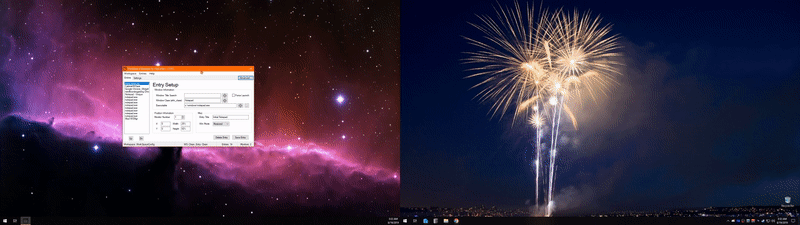

# WorkSpace Manager

Do you often want a complex set of applications/files open to start working? Do you always forget to launch that one application when sitting down to work? Do you have different methods of working depending on the task at hand?

I know I do, so I set out to build a simple tool to make it super easy to get your WorkSpace defined and manageable.

With **WorkSpace Manager**, you can get your environment up and running within mere seconds!

# Features

* Multiple Workspace configurations for any scenario
* Multi-Monitor Support
* Run Apps, URLs, or open a file with the default program
* Quickly "Hunt" Windows with the bundled **Window Hunter**
* Position Windows
* Send Mouse/Keyboard instructions to an Application
* Change Window Styles

For more details about the feature list, be sure to check out the [Wiki](../../wiki)

# Download / Install

Downloading is easy, and -*SURPRISE*-, there's no install!

Just head over to [Downloads](../../downloads), grab the latest version, and unzip wherever you'd like!

This project (as most of mine are) is Open Source, and you can also run from that as well. Be sure to check out the [Developer](./docs/dev.md) documentation for more info.

# Usage / Help / Troubleshooting

Need help understanding how to use the tool? Check out the [Wiki](../../wiki) for detailed information.

# Support / Dev PRs

While this tool is free, if you'd like to throw a few bones our way for Coffee or a new Game, you can do so on our [Donation page](http://rebrand.ly/nfgDono).

PRs are always welcome, so create a fork and get at it! Be sure to check out the [Developer](../../wiki/dev) documentation for more info about the project and structure.