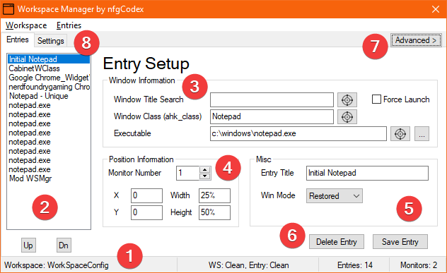
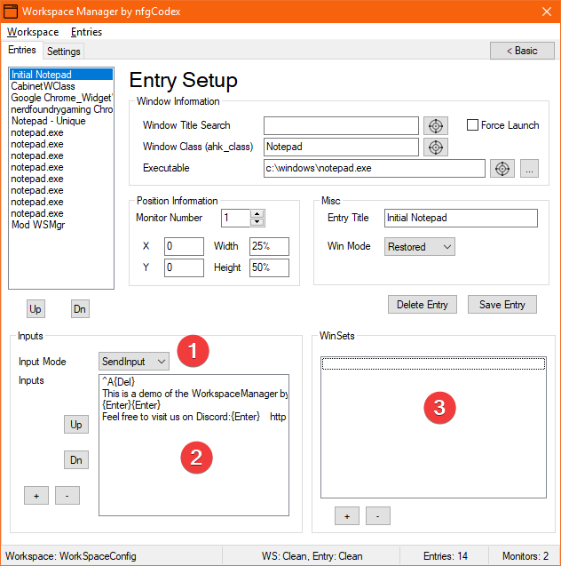
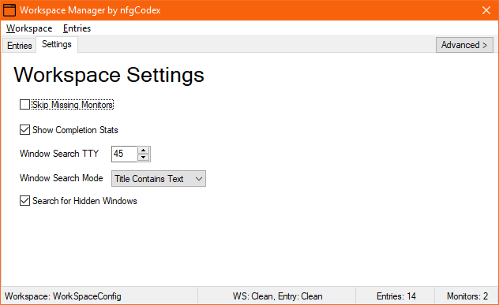
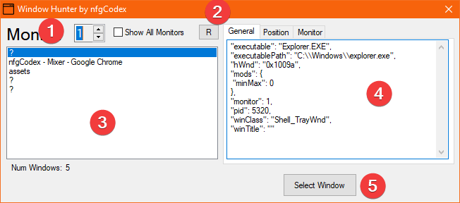

# How to Use WorkSpace Manager

> WorkSpace Manager was built in **AutoHotKey**, and thus some documentation will reference their own documentation. Also because of this, some issues may be out of our hands!

## Install / Files

**WorkSpace Manager** is downloaded as a Zip file, and comes with two binaries (`EXE` files), an icon, and a default `WorkSpaceConfig.json`.

You can unzip these anywhere you want, and will not store or read any information other than configs you build.

> By default, all tools will look for a `WorkSpaceConfig.json` next to the binary file and fail if not found or another config specified can't be found.

> The supplied icon is not necessary should you don't want to keep it around. Your "Target" buttons will turn into a `Find` button.

## Silent Execution

Once you have a WorkSpace configuration you like, you'll likely want to run the layout silently.

`wsmgr.exe` will execute either the `WorkSpaceConfig.json`, or a config file specified after the binary name.

Example:

`wsmgr.exe`

or

`wsmgr.exe "c:\path\to\your\config.json"`

> Pro-tip: You can create Windows Shortcuts, bind to a key with a macro tool, or use a tool like the elgato Stream Deck to kick off your WorkSpace(s)

## Editing a Config

> To avoid errors in the config, please stick to using the supplied Editor!

### Main Window

#### 1 - Status Bar

Here you can see the WorkSpace name, the WorkSpace Status (i.e., Dirty or Clean), the current Entry's Status, how many Entires are in the Workspace, and how many Monitors detected.

#### 2 - Entry List

A list of the Entries in the WorkSpace. You can change order with the `Up` and `Dn` buttons just below it. The name shown here is either the `Entry Title` value, or generated based on a combination of `Window Title Search`, `Window Class`, and `Executable`.

#### 3 - Window Information

The Window Information box is very important for an Entry. It defines how to find a Window by both a Title, and a Window Class.

If the Window cannot be found, it will be launched for you!

For all three inputs, you can click the `Find`/Target button to then click another Window and automatically retrieve the information for you.

`Window Title Search` - The title of the Window to look for. By default the lookup is very loose, and will search anywhere in the title. To change this behaviour, see *WorkSpace Settings*.

`Window Class (ahk_class)` - The class of the Window to look for. This input is completely optional, but can help you target a specific type of Window should more than one Window have the same Title matching. It needs to be *exact*, so rely on the `Find`/Target button, or use the **Window Hunter** to get this value.

`Executable` - The run path to execute should a qualifying Window not be found. This can be anything from an EXE, to a URL, or directly targeting a file and letting the Operating System determine how to open (i.e., a `hello.txt` file would typically open with `notepad.exe`). You can either use the `Find`/Target button, or click the `...` button to choose the Executable. A quick caveat is that Windows Store Apps (and possibly other types) will return an incorrect executable to actually start your application. For more info, see *Troubleshooting*.

#### 4 - Position Information

Pretty straightforward on the surface, but there's some interesting things to note.

First, the positioning is relative to the Monitor that is targeted. So instead of figuring out a giant negative offset to go to your secondary/left Monitor (assuming the right Monitor is your primary) such as `-1920` to be at the far left of your Monitor, you can simply put `0`.

Another thing to consider is that offsets consider blocking components, such as the taskbar. If your taskbar is at the top of your screen, `0, 0` will not be at the top of your monitor, but rather just under the taskbar.

Last thing to note is the actual values you can use for positioning. The most obvious would be explicit pixel dimensions, but you can use percent values as well (i.e., `50%`) and the offset will be calculated when needed. This is useful for WorkSpaces that just need to fill an area, or if you want to fill the height to 100% for a Window instead of supplying exact pixels. It's also nice if you move to another Work Station and have different resolutions in play.
Another option for positioning is using *negative* values, which will then perform calculations based on the opposite side of the Monitor.

Examples (assuming 1920x1080 for all Monitors):

* Monitor 1, set to 100, 100 - Puts a Window at `100, 100` on Monitor 1.
* Monitor 1, set to 50%, 0 - Puts a Window at `960, 0` on Monitor 1
* Monitor 1, set to -500, -200 - Puts a Window at `1420, 880` on Monitor 1

#### 5 - Misc

`Entry Title` - What title you want to show in the `Entry List`. This is merely decorative, and doesn't have any impact on a WorkSpace.

`Win Mode` - Whether you want the window to be Maximized, Minimized, or "Restored". Restored is the default value, which basically means it's not Max/Min and can be resized by **WorkSpace Manager**.

#### 6 - Delete / Reset / Save

`Delete/Reset` - An edited Entry (or brand new) will show `Reset` instead of `Delete`, and will revert to the last saved settings. A new Entry will also be deleted since there's nothing to revert to.

`Save` - Save the Entry, and the WorkSpace.

#### 7 - Advanced Options

This will open the Window more for the *Advanced Options*, which are described in their own section below.

#### 8 - WorkSpace Settings Tab

This will open the *WorkSpace Settings*, which are described in their own section below.

### Advanced Entry Settings

#### 1 - Inputs / Input Mode

Once a Window has been identified and moved, Inputs can then be sent to said Window.

Because some Windows use different means of capturing input, there are different ways to actually send these. By default, we choose the most common, but you may need to tinker with this should it not work right for you (especially with games).

> See [AHK's Send documentation](https://www.autohotkey.com/docs/commands/Send.htm) for further explanation on how the different modes work. For games, try `SendPlay` if `SendInput` isn't working.

#### 2 - Input List

The `Input List` shows the existing Input Entries provided.

You can change their order the same as the `Entry List` with the `Up` and `Dn` buttons.

To Add or Remove an entry, use the `+` and `-` buttons respectively.

Double-Clicking an Input Entry will allow you to edit.

> See both [AHK's Send](https://www.autohotkey.com/docs/commands/Send.htm) and [Key List](https://www.autohotkey.com/docs/KeyList.htm) documentation. Be sure to note that `!` and `+` (among others) have special meaning and will need to be escaped with `{}` (i.e., `{!}`).

#### 3 - WinSets

This is named after the command in **AHK**, but essentially allows you to make a variety of changes to the Window.

The format of the entry should be: `SubCommand, Value`

Optional values (such as `WinTitle`, `WinText`, etc) are ignored.

Examples:

`AlwaysOnTop, On`
`Transparent, 200`

> See [AHK's WinSet documentation](https://www.autohotkey.com/docs/commands/WinSet.htm) for more information on the different `SubCommand`s and their values. The `Style` and `ExStyle` `SubCommand`s must be added as multiple Entries for multiple changes (i.e., they cannot be combined into a single Entry).

### WorkSpace Settings

These settings apply to the entirety of the WorkSpace, and may affect the results of laying out a WorkSpace.

`Skip Missing Monitors` - If enabled, when a targeted Monitor for an Entry is missing, the Entry will be skipped. This is useful for using the same WorkSpace configuration across different Work Stations (i.e., Multi-Monitor Desktop and a Laptop). If disabled it will default to your Primary Monitor.

`Show Completion Stats` - Tells you when the WorkSpace has finished laying out, along with how many Windows were successfully placed, and how many were Skipped.

`Window Search TTY` - How long to wait (or Time to Yield) for searching for a Window before skipping. For applications that take a while to start (i.e., Photoshop/After Effects, a game, etc) you will want to increase this value. See *Troubleshooting* for more information.

`Window Search Mode` - By default, the title only needs to contain the text put in the Entry's `Window Title` input somewhere within the actual titlebar. If this is too loose of a selection, or the search time seems too slow, feel free to play with this.

> See [AHK's SetTitleMatchMode documentation](https://www.autohotkey.com/docs/commands/SetTitleMatchMode.htm) for further explanation on how the different modes work. Only Modes 1-3 are available at this time.

`Search for Hidden Windows` - Typically you won't need to mess with this, but in the event a Window is deemed as "hidden", this can help work around search/skip issues.

> See [AHK's SetTitleMDetectHiddenWindowsatchMode documentation](https://www.autohotkey.com/docs/commands/DetectHiddenWindows.htm) for further explanation on how the different modes work.

### Window Hunter

The Window Hunter is a bundled tool to help identify available Windows, their meta-data for `Window Information`, as well as Position and Monitor Information.

For the most part, most of this info can be ignored, but it's useful to see in order to ensure you're targeting the correct Window.

#### 1 - Monitor Selection

Change the number to only show Windows on that Monitor. To see Windows on ALL Monitors, check the `Show All Monitors` checkbox.

#### 2 - Refresh (R)

Refreshes the list, in case your Window wasn't open at the time **Window Hunter** did a scan.

#### 3 - Window List

List of all visible Windows found by **Window Hunter**.

Windows that are found but don't contain a Window Title will be displayed with a `?`. These are typically not actually Windows you'd want to target, but the Operating System's tools such as the SysTray. You *COULD* potentially use them explicitly for sending Inputs to for advanced users.

#### 4 - General / Position / Monitor Information

As mentioned above, you can mostly ignore this information. However, it may be that you have similar Windows open, and need more information in determining if the correct Window is being selected for addition.

#### 5 - Select Window

When **Window Hunter** is in selection-mode, this button will send the Window meta-data to the **WorkSpace Manager Editor** to populate all the necessary inputs.